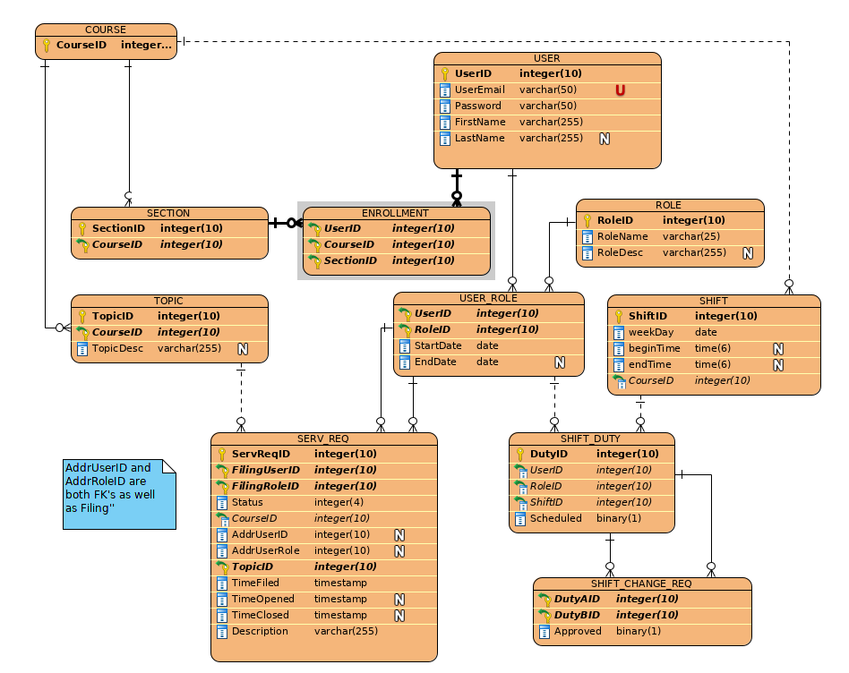

# JMU Computer Science TA Hours

This web application implements the current Teacher’s Assistant service ran by James Madison University.  It is a system for helping students that involves asking students to place their names, classes, and problems on a whiteboard to be entered into a queue to be helped.

## Building the project
1. Clone the git repository, naming it `clef`,  to the filesystem that hosts the webpages XAMPP (LAMP,  WAMP, etc.).
2. After the code has been pulled into your XAMPP (LAMP,  WAMP, etc.) environment, start MySQL Database and Apache Server.  
3. In any text editor of your choice, open `clef/sql/clef_ddl.sql`, and select and copy all of the text in the document. 
4. Open phpMyAdmin and navigate to the SQL tab.
5. Paste the contents of `clef/sql/clef_ddl.sql` into the SQL environment in phpMyAdmin. Hit Go. You should see a number of green rows that show the successful building of the database and seeding of some starter data. 
6. Open another browser tab. Navigate to `localhost/clef/api/data/seedDatabase.php`. This step seeds the database with user data, and must be done this way to salt and hash their password correctly. 
7. Finally, repeat steps 3, 4, and 5 using the pasted contents of `clef/sql/seed_schedule.sql`
8. At this point the system should be ready to use

## Features
The main features we focused on were implementing different views based on the role a user has. There are four roles, a student, a TA, a professor, and an administrator. Each role and can see certain views and some can see more or less views than others. In order to get this feature to work the website needs a functioning signup and login system. Users can be registered with the system by giving a few credentials about themselves such as a username, email and password. One of the other major features we wanted to implement was a functioning queue and forum. The way we went about implementing the forum was to imbed piazza into our website. Although we did implement the queue as well, it is not connected to our backend and therefore is not fully functional. The calender is another core feature of the website, the calander is available to all views and has information of what TA's are working on what day and at what time. Unfortunately we were not able to make the calander dynamic and thus shift changes need to be processed and approved by an admin and manually changed in the calander.    
### Roles
Students will be able to log into their course that they have come for help with and see a forum page, similar to Piazza where students will be able to post anonymous questions that can be answered by the TA or another student. Students will also be able to add themselves to a queue for one on one time with a TA. 
TA’s will be able to see and respond to the forum posts written by the students in the system. TA’s will also be able to view the queue of students waiting to be helped. TA’s will be able to edit their hours if need be and request shift changes.
Administrators will create, edit, and administer a schedule to the website. The schedule will be based on the inputs given by the TA’s. An administrator is the only person that can confirm and commit schedule changes between TA’s. 
Professors that is in the works.
### Scheduling Preferences
As a TA you will have an availability form to fill out that allows you to choose what time or times you can/would like to work and what days.  It also asks for your full name, phone number, and email address.  Since the professors hired you, they have a specific course they already want you to TA for so you don’t have to specify class/course.
This availability form also covers the entire semester. So if you need off for a specific day that you are scheduled you can use the Shift Cover part of the application.
### Swap Duties
As a TA you will be able to swap a shift with someone.  There will be two option bars and you can select the shift you would like to change and the other option bar will contain the person who is swapping with you's shift. It will then be sent to an admin to approve it and then be entered into the database. 
### Calendar/Schedule
The calendar has all of the TA's schedules posted for everyone to see.  This was TA's know when their normal shifts are, unless swapped a week in advance so the admin can modify the calendar.  The students can also see when the TAs work and for which classes.
### Queue
The queue is not fully function at this moment.  We were able to implement a list view where a student can insert their name and add themselves to the list.  It is not currently hooked up to the database, therefore does not save when closed and multiple people cannot access it at the same time.  Given more time to work on this project we would have integrated this into our data model, which would have allowed the names to be saved upon switching pages and multiple users being logged in at the time.

## Data Model

## Authors

* [Josh Ehrlich](https://github.com/joshehrlich24/)
* [Nathan Moore](https://github.com/nathan-moore-97/)
* [Brandon Parr](https://github.com/parrbt/)
* [Angela Preziuso](https://github.com/angpreziuso/)

## Acknowledgments
* https://www.w3schools.com/w3css/tryit.asp?filename=tryw3css_templates_start_page&stacked=h
* https://www.w3schools.com/howto/howto_css_login_form.asp
* https://www.w3schools.com/howto/howto_css_signup_form.asp
* https://w3.cs.jmu.edu/lam2mo/cs432_2019_08/calendar.html
* https://www.w3schools.com/howto/howto_js_todolist.asp
